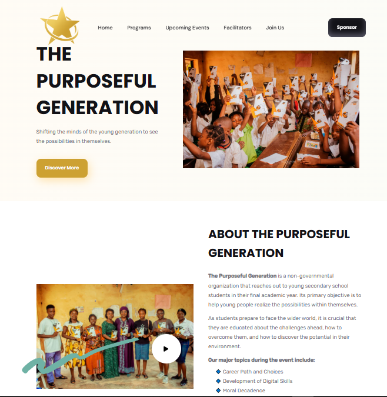

  
   
   
  
  

  <h2 align="center">Eduland - Landing page</h2>

  The Purposeful Generation is a fully responsive NON-ORG landing page,  Responsive for all devices, built using HTML, CSS, and JavaScript.

  <a href="https://brightsitedevapp.github.io/TPG/"><strong>➥ Live Demo</strong></a>

 

### Demo Screeshots

If you want to contact with me you can reach me at [Twitter](https://www.twitter.com/codewithsadee).

### License

This project is **free to use** and does not contains any license.
